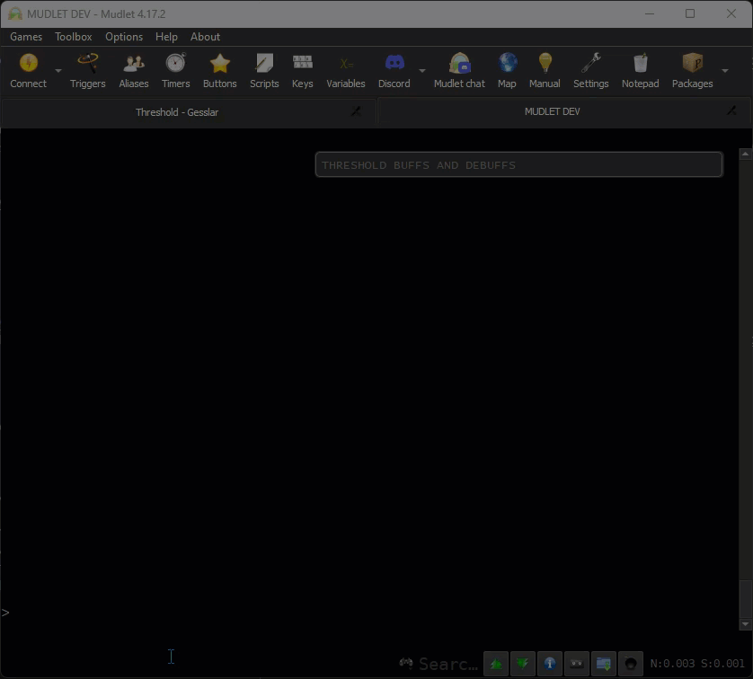

# Mupdate Auto-Updater Module

## Description
This module provides an auto-updater for packages within the MUD client, [Mudlet](https://github.com/Mudlet/Mudlet/). It automates the process of checking for new versions of a package, downloading updates, and installing them.

## Acknowledgements
This module was essentially ripped off from the [MUDKIP_Mud2](https://github.com/11BelowStudio/MUDKIP_Mud2) package from [@11BelowStudio](https://github.com/11BelowStudio/), and refactored.

### Original acknowledgements on the MUDKIP_Mud2 package:
The core functionality of this auto-updater was adapted from the DSL PNP 4.0 Main Script by Zachary Hiland, originally shared on the [Mudlet forums](https://forums.mudlet.org/viewtopic.php?p=20504).

Special thanks to [@demonnic](https://github.com/demonnic/) for providing additional Lua code and guidance on package installation.



## Instructions for Use

### 1. Placement
- **Using [Muddler](https://github.com/demonnic/muddler):** Put the `Mupdate.lua` file in your project's resources directory.
- **Developing Directly in Mudlet:** Add the `Mupdate.lua` file to your Mudlet package's Script Group within Mudlet, and ensure that it is higher than the script that will be calling it.

### 2. Integration
In your package script, require the Mupdate module and instantiate it with the necessary options.

### Variables:
* `download_path`: The URL path where the package files are hosted.
* `package_name`: The name of your package.
* `remote_version_file`: The file name of the version check file on the server.
* `param_key`: (Optional) The key of the URL parameter to check for the file name.
* `param_regex`: (Optional) The regex pattern to extract the file name from the URL parameter value.
* `debug_mode`: (Optional) Boolean flag to enable or disable debug mode for detailed logging. Defaults to `false`.

#### Example Implementation:
```lua
-- Auto Updater
function ThreshCopy:Loaded()
    -- If using muddler
    -- require("ThreshCopy\\Mupdate")
    if not Mupdate then return end

    -- GitHub example
    local updater = Mupdate:new({
        download_path = "https://github.com/gesslar/ThreshCopy/releases/latest/download/",
        package_name = "ThreshCopy",
        remote_version_file = "ThreshCopy_version.txt",
        param_key = "response-content-disposition",
        param_regex = "attachment; filename=(.*)",
        debug_mode = true
    })
    updater:Start()
end

-- Start it up
ThreshCopy.LoadHandler = ThreshCopy.LoadHandler or registerAnonymousEventHandler("sysLoadEvent", "ThreshCopy:Loaded")
```

### Version Comparison
* Mupdate calls `getPackageInfo(packageName)` to get your package's version number. Which must be in the SemVar format. So, this must be set on your package.
* Mupdate downloads the version file from the same location that hosts your `.mpackage` file, and its contents must simply contain the updated version in the SemVar format.

### Semantic Versioning
The Mupdate system requires the use of semantic versioning (SemVer) for package version numbers. Semantic versioning follows the format MAJOR.MINOR.PATCH, where:

* `MAJOR` version increments indicate incompatible API changes,
* `MINOR` version increments add functionality in a backward-compatible manner, and
* `PATCH` version increments include backward-compatible bug fixes.
#### Example:
* `1.0.0` -> Initial release
* `1.1.0` -> New feature added
* `1.1.1` -> Bug fix
* `2.0.0` -> Breaking change introduced
